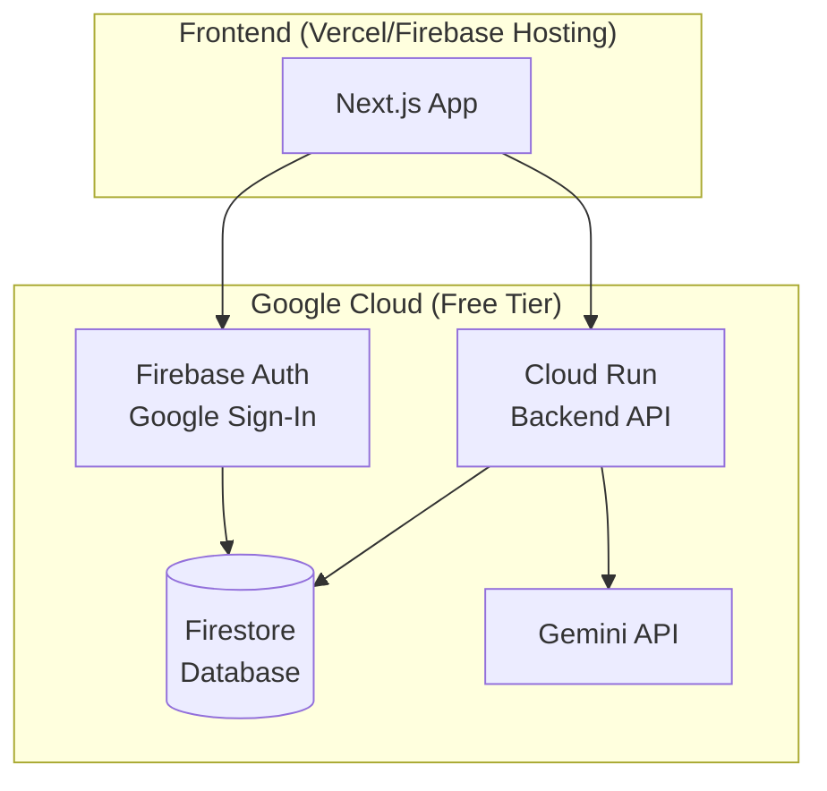

# Scientific Research Orchestrator - Implementation Plan

## Overview

Build a **zero-cost, Google-first SaaS** multi-agent research platform where users lead panels of specialized AI experts to collaboratively solve scientific research problems.

> [!IMPORTANT]  
> This architecture is designed for **$0 monthly cost** at low-to-moderate usage levels using Google Cloud free tiers.

---

## Architecture



### Technology Stack

| Layer | Technology | Free Tier Limits |
|-------|------------|------------------|
| **Frontend** | Next.js 14 + TypeScript | Vercel Hobby: 100GB bandwidth |
| **Backend API** | Google Cloud Run | 2M requests/month, 360K GB-seconds |
| **Database** | Firebase Firestore | 1GB storage, 50K reads/20K writes per day |
| **Auth** | Firebase Auth + Google OAuth | Unlimited users |
| **AI Engine** | Google Gemini 1.5 Flash | Free tier with rate limits |
| **Real-time** | Firestore listeners | Included in read quota |

---

## User Review Required

> [!WARNING]  
> **AI API Costs**: While Gemini has a free tier, heavy usage may exceed limits. Consider:
> - Implementing rate limiting per user
> - Caching common responses
> - User-provided API keys for power users

> [!IMPORTANT]  
> **Google Cloud Setup**: You'll need to:
> 1. Create a Google Cloud project
> 2. Enable billing (free tier still requires billing account)
> 3. Enable Firebase, Cloud Run, and Gemini APIs

---

## Proposed Changes

### Phase 1: Project Foundation

#### [NEW] Project Structure

```
Antigravity/
├── src/
│   ├── app/                    # Next.js App Router
│   │   ├── (auth)/             # Auth routes
│   │   │   ├── login/
│   │   │   └── callback/
│   │   ├── (dashboard)/        # Protected routes
│   │   │   ├── layout.tsx
│   │   │   └── page.tsx
│   │   ├── api/                # API routes (proxy to Cloud Run)
│   │   ├── layout.tsx
│   │   └── page.tsx
│   ├── components/
│   │   ├── chat/               # Chat interface components
│   │   ├── agents/             # Agent sidebar components
│   │   ├── mission/            # Mission control components
│   │   └── ui/                 # Shared UI components
│   ├── lib/
│   │   ├── firebase.ts         # Firebase client config
│   │   ├── gemini.ts           # Gemini API client
│   │   └── agents/             # Agent definitions & logic
│   ├── hooks/                  # Custom React hooks
│   ├── types/                  # TypeScript types
│   └── styles/                 # Global styles
├── functions/                  # Cloud Run backend (optional separate)
├── firebase.json               # Firebase config
├── next.config.js
├── package.json
└── tailwind.config.js
```

---

### Phase 2: Authentication System

#### [NEW] [firebase.ts](file:///d:/Nuwan/Concept_Papers/Orchestrator/Antigravity/src/lib/firebase.ts)
- Initialize Firebase app with config
- Export Auth instance with Google provider
- Export Firestore instance

#### [NEW] [AuthProvider.tsx](file:///d:/Nuwan/Concept_Papers/Orchestrator/Antigravity/src/components/AuthProvider.tsx)
- React context for auth state
- Google Sign-In button component
- Protected route wrapper

---

### Phase 3: Agent System

#### [NEW] [types/agent.ts](file:///d:/Nuwan/Concept_Papers/Orchestrator/Antigravity/src/types/agent.ts)
```typescript
interface Agent {
  id: string;
  name: string;
  initials: string;
  color: string;
  role: string;
  description: string;
  systemPrompt: string;
  capabilities: string[];
  restrictions: string[];
  canExecuteCode: boolean;
  canWebSearch: boolean;
  modelTier: 'advanced' | 'standard';
  isCustom: boolean;
  isActive: boolean;
}
```

#### [NEW] [lib/agents/definitions.ts](file:///d:/Nuwan/Concept_Papers/Orchestrator/Antigravity/src/lib/agents/definitions.ts)
- Define all 12 predefined agents from specification
- System prompts with collaboration rules
- Capability and restriction definitions

---

### Phase 4: Chat & Messaging

#### [NEW] [types/message.ts](file:///d:/Nuwan/Concept_Papers/Orchestrator/Antigravity/src/types/message.ts)
```typescript
interface Message {
  id: string;
  projectId: string;
  senderId: string;          // 'user' or agent ID
  senderName: string;
  content: string;
  timestamp: Timestamp;
  sources?: { url: string; title: string }[];
  signals?: ParsedSignal[];
}
```

#### [NEW] [components/chat/ChatArea.tsx](file:///d:/Nuwan/Concept_Papers/Orchestrator/Antigravity/src/components/chat/ChatArea.tsx)
- Message list with auto-scroll
- Message bubbles (user vs agent styling)
- Streaming response display
- Sources/references section

#### [NEW] [components/chat/ChatInput.tsx](file:///d:/Nuwan/Concept_Papers/Orchestrator/Antigravity/src/components/chat/ChatInput.tsx)
- Multi-line text input
- Direct Ask agent buttons
- Send button with loading state
- Keyboard shortcuts (Enter/Shift+Enter)

---

### Phase 5: Project Management

#### [NEW] [types/project.ts](file:///d:/Nuwan/Concept_Papers/Orchestrator/Antigravity/src/types/project.ts)
```typescript
interface Project {
  id: string;
  userId: string;
  name: string;
  phase: ResearchPhase;
  phaseStartedAt: Timestamp;
  objectives: Objective[];
  actionItems: ActionItem[];
  alerts: Alert[];
  activeAgentIds: string[];
  customAgents: Agent[];
  createdAt: Timestamp;
  updatedAt: Timestamp;
}

type ResearchPhase = 
  | 'Brainstorm' 
  | 'Hypothesis Generation' 
  | 'Experimental Design' 
  | 'Evaluation' 
  | 'Conclusion';
```

#### [NEW] [components/mission/MissionControl.tsx](file:///d:/Nuwan/Concept_Papers/Orchestrator/Antigravity/src/components/mission/MissionControl.tsx)
- Phase stepper with elapsed time
- Objectives checklist
- Delegated tasks section
- Panel health metrics
- Alerts display

---

### Phase 6: AI Integration

#### [NEW] [lib/gemini.ts](file:///d:/Nuwan/Concept_Papers/Orchestrator/Antigravity/src/lib/gemini.ts)
- Gemini API client with streaming
- Agent-specific model selection
- Context management (last 15 messages)
- Response signal parsing

#### [NEW] [lib/signals.ts](file:///d:/Nuwan/Concept_Papers/Orchestrator/Antigravity/src/lib/signals.ts)
- Parse `[PHASE: ...]` signals
- Parse `[COMPLETED: ...]` signals
- Parse `[NEW_OBJECTIVE: ...]` signals
- Parse `[ALERT: ...]` signals
- Parse delegation patterns `* **Agent Name:** Task`

---

### Phase 7: Database Schema (Firestore)

```
users/
  {userId}/
    - email
    - displayName
    - photoURL
    - createdAt

projects/
  {projectId}/
    - userId
    - name
    - phase
    - phaseStartedAt
    - objectives[]
    - actionItems[]
    - alerts[]
    - activeAgentIds[]
    - customAgents[]
    
    messages/
      {messageId}/
        - senderId
        - senderName
        - content
        - timestamp
        - sources[]
```

---

## Verification Plan

### Development Testing

1. **Local Development Server**
   ```bash
   cd d:\Nuwan\Concept_Papers\Orchestrator\Antigravity
   npm run dev
   ```
   - Verify app loads at `http://localhost:3000`
   - Test Google Sign-In flow
   - Test chat messaging with mock responses

2. **Firebase Emulator Suite**
   ```bash
   firebase emulators:start
   ```
   - Test Firestore rules locally
   - Test Auth flows without hitting production

### Manual Verification

| Test | Steps | Expected Result |
|------|-------|-----------------|
| **Google Login** | Click "Sign in with Google" → Select account | Redirected to dashboard, user name shown |
| **Send Message** | Type message → Press Enter | Message appears, agent responds |
| **Direct Ask** | Click agent's "Direct Ask" button → Send message | Specific agent responds |
| **Toggle Agent** | Check/uncheck agent in sidebar | Agent added/removed from active panel |
| **Phase Change** | Click phase in stepper → Confirm | Phase updates, timer resets |
| **Add Objective** | Type in objective field → Submit | New objective appears in list |

### Production Deployment Test

After deploying to Firebase/Vercel:
1. Visit production URL
2. Complete Google Sign-In
3. Create a new research project
4. Send messages and verify AI responses stream correctly
5. Verify data persists on page refresh

---

## Implementation Order

1. **Project setup** - Initialize Next.js, configure Firebase
2. **Authentication** - Google Sign-In working
3. **UI shell** - Three-panel layout (agents, chat, mission control)
4. **Agent system** - Sidebar with toggles, predefined agents
5. **Chat interface** - Send/receive messages (mocked)
6. **Gemini integration** - Real AI responses with streaming
7. **Signal parsing** - Auto-update project state
8. **Project management** - Phases, objectives, tasks
9. **Persistence** - Firestore read/write
10. **Deployment** - Firebase Hosting + Vercel
